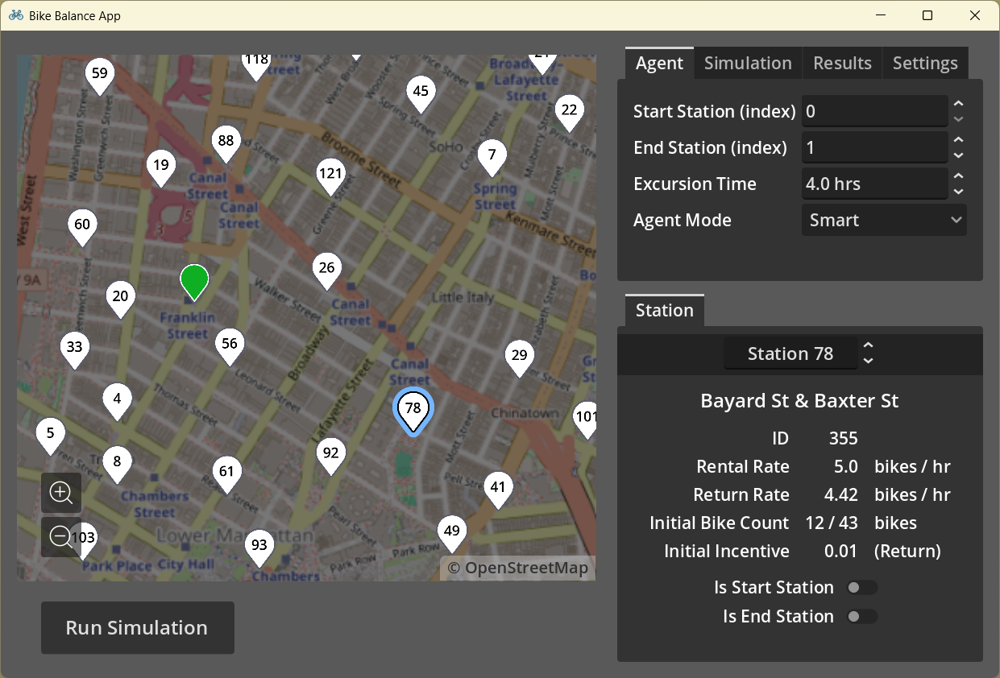
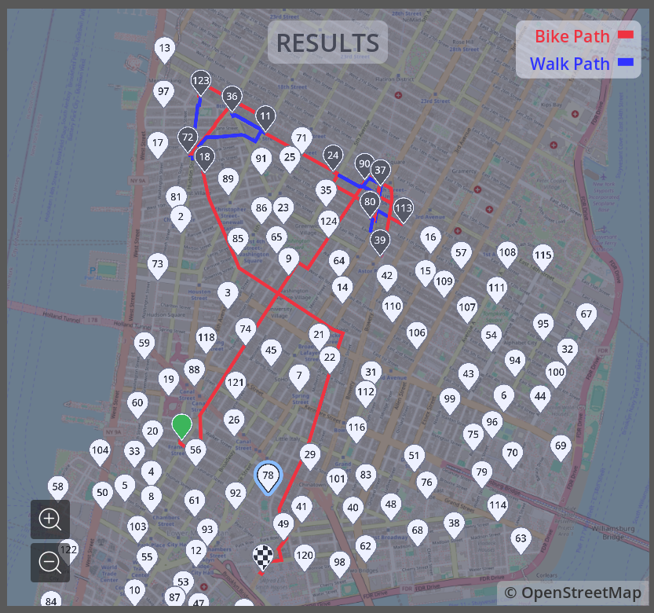
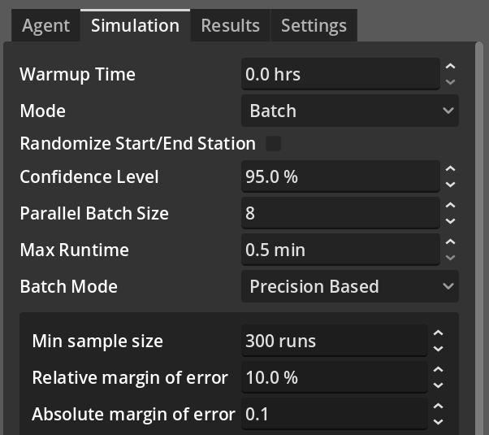
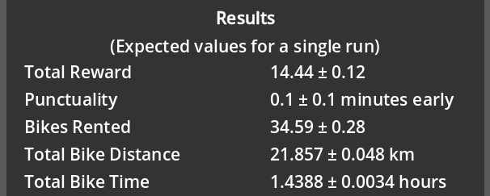

# Bike Balance
Bike Balance is an offline bike share simulation app. This app is a research project that serves as a proof of concept for using search algorithms to optimize the rewards earned by individuals who rebalance bike stations, to the benefit of the bike share system.

The parameters included in Bike Balance's release are extracted from historical trip data of New York's Citi Bike system in Spring 2016, just before the introduction of the Bike Angels program (which incentivizes riders to rebalance stations). This allows Bike Balance to isolate rebalancers from regular riders for simulation purposes (and it's difficult to find recent records of station bike counts). 

This release examines two different strategies for a single agent taking trips to rebalance station for a given period of time. The basic greedy strategy always goes to the station that gives the most reward per trip time, while the smart agent uses a predictive Monte Carlo tree search to earn more rewards in the long run.

## Features
The interface allows simulation parameters to be set easily:

For single run simulations, Bike Balance features a map of the bike route taken.

For batch simulations, Bike Balance features a precision-based mode that performs replications until the desired margin of error is met:

 

## Requirements
- Windows 7 or later
- Python 3.10 or later

Note: Bike Balance has only been tested on Windows 11 with Python 3.12, but it should be compatible with the earlier versions stated.

## How to Install

1. Download the latest release. 

2. Unzip and move folder to desired install location.

3. Open `Bike Balance.exe`

For further instructions, reference the [User Manual](https://github.com/Yffum/bike-balance-app/wiki/User-Manual).

## How to Build
Requires [Godot 4.4.1](https://godotengine.org/download/archive/4.4.1-stable/)

1. Create an empty base folder for the application.

2. Open the source directory in [Godot 4.4.1](https://godotengine.org/download/archive/4.4.1-stable/).

3. Go to Project > Export... in the menu bar.

2. Export the project to the base folder.

5. Move the contents of `/external` in the source directory to the base folder.

## Attributions
Bike Balance is designed and built in Godot 4.4.1 (MIT License © 2007–present contributors).

Icons used in Bike Balance are sourced and modified from Glyphs.fyi (MIT © Goran Spasojevic).

Travel times, distances, and paths are collected from OpenRouteService; the map image is from OpenStreetMap (© openrouteservice.org by HeiGIT | Map data © OpenStreetMap contributors).

I would like to thank my mentor, Dr. Felisa Vazquez-Abad, for her guidance and support, particularly with designing a simulation that runs efficiently while sufficiently modeling the real world. I am also grateful to my colleague, Ben Rosenberg, for suggesting the idea to simulate Citi Bike rebalancing.
